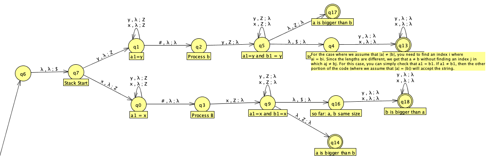
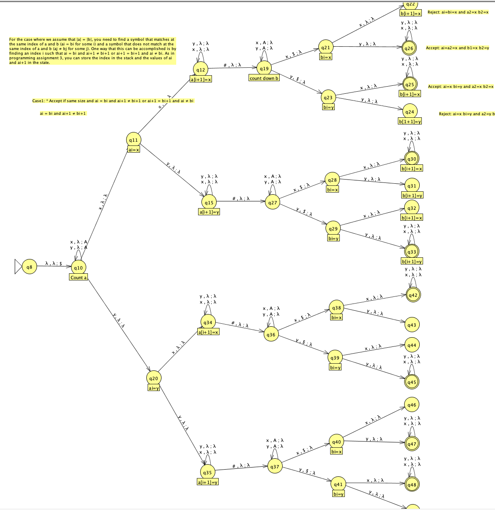

# JFLAP Push Down Automata (PDA): String Comparison Automaton

This project implements a non-deterministic Pushdown Automaton (PDA) using JFLAP to compare two strings separated by '#'. 

## Problem Description

Formally, the PDA (Push Down Automata) accepts the language:
{ a#b | a, b ∈ {x, y}* such that a ≠ b and ai = bi for some i, 1 ≤ i ≤ min(|a|, |b|) }

The automaton handles two main cases:
1. When |a| ≠ |b|:
   - Must find an index i where ai = bi
   - The length difference automatically ensures a ≠ b
   - Simplified by checking if a1 = b1

2. When |a| = |b|:
   - Must find an index i where ai = bi
   - Must also find an index j where aj ≠ bj
   - Implemented by finding an i where either:
     * ai = bi and ai+1 ≠ bi+1, or
     * ai+1 = bi+1 and ai ≠ bi

## Implementation Details

- Type: Non-deterministic PDA
- Input alphabet: {x, y, #}
- Stack alphabet: {Z, A, $}
- Stack usage:
  * Z: Used as position markers
  * A: Used for counting/comparing string lengths
  * $: Used as end-of-stack marker

### State Organization

The PDA is organized into two major sections:
1. States handling |a| ≠ |b| case
2. States handling |a| = |b| case

The implementation requires non-determinism to:
- Choose between the two cases
- Find matching/non-matching positions
- Handle different length combinations

## Files

- `eskenazi_p4.jff`: Final implementation of the PDA
- `eskenazi_p4_tests.txt`: Comprehensive test cases

## Test Cases

The test file includes:
- Different length strings (|a| ≠ |b|)
- Equal length strings with required patterns
- Edge cases for both acceptance criteria
- Invalid strings for rejection testing

### Test File Format
- One test case per line
- Cases before "BEGING_REJECT" should be accepted
- Cases after "BEGING_REJECT" should be rejected

## Usage

1. Open `eskenazi_p4.jff` in JFLAP 7.1
2. Load test inputs from `eskenazi_p4_tests.txt`
3. Run the automaton to verify acceptance/rejection
4. Use step mode to visualize state transitions

## Assumptions

- Input always contains exactly one '#'
- All strings are composed of only 'x' and 'y' characters
- Input strings follow the format a#b where a,b ∈ {x,y}*
 

## Tests

### Accept

- xy#xx
- xy#xyy
- xx#xxx
- xx#x
- xxx#xx
- y#yy
- yy#yyy
- yy#yyy
- yyy#yy
- x#xy
- y#yx
- xx#xyx
- yy#yxy
- xx#xxx
- xx#x
- xxx#xx
- y#yy
- yy#yyy
- yy#yyy
- yyy#yy
- y#yx
- xx#x
- x#xy
- yy#y
- x#xx
- xy#xyx
- xyx#xy
- xxy#xyyy
- xx#yxy
- yy#xyx
- xyx#yyy
- xyx#yxx
- xyy#xxx
- xyy#xxx
- yxy#xxx
- yyx#xxx
- xyy#yyy
- yxy#yyy
- yyx#yyy
- yyxyxy#yxyxyx
- xyyyxy#yxyxyx
- xyxyxx#yxyxyx
- yxxxxxy#yxxxxxxy
- xxxxxxxy#xxxxxxy
- yxxxxxx#yxxxxxxx

### Reject

- x#yy
- x#yx
- y#xx
- y#xy
- xx#yyx
- yy#xxy
- y#xy
- x#x
- xx#xx
- xxx#xxx
- xxxx#xxxx
- y#y
- yy#yy
- yyy#yyy
- yyyy#yyyy
- x#y
- xx#yy
- xxx#yyy
- xy#xy
- yx#yx
- xxy#xxy
- yyx#yyx
- xyxyxy#xyxyxy
- xyxyxy#yxyxyx
- xy#xy
- xyx#xyx
- xyxy#xyxy
- yx#yx
- yxy#yxy
- yxyx#yxyx
- yxxxxxxy#yxxxxxxy
- xxxxxxxy#xxxxxxxy
- yxxxxxxx#yxxxxxxx
- xy#yx
- yx#xy
- #x
- x#
- `#`
